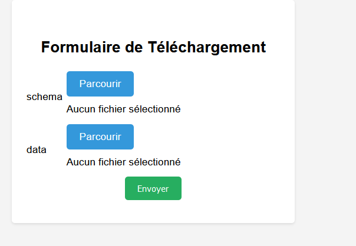

# Data_Validate
A PHP code that validates data received in JSON format according to a data model in the OpenAPI 3 format. 
The view contains a small HTML, CSS, and JavaScript code to upload both the model and the payload.  
The JSON folder contains the files that can be used for testing.

## Screenshot

